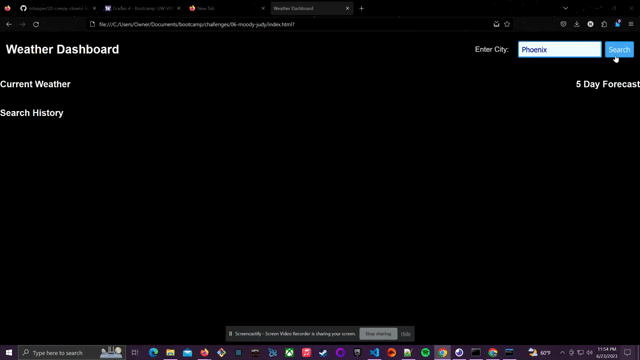

# Weather Dashboard

## Description 

Weather Dashboard is a dynamic web application that provides users with real-time weather data, including current conditions and a five-day forecast, for any city they search. This application is especially handy for travelers who need to plan their trips based on weather conditions. 

## Features 

- Search for a city and retrieve its current weather conditions (temperature, humidity, and wind speed).
- View a 5-day weather forecast for the searched city.
- An intuitive UI displaying an icon representation of weather conditions.
- Previous city searches are saved in the search history for quick access. 

## Technologies Used

- HTML5
- CSS3
- JavaScript
- jQuery
- OpenWeatherMap API

## Installation

No installation is needed. Simply open the `index.html` file in your preferred web browser.

## Usage

1. Locate the search box in the dashboard.
2. Enter a city name into the search box and press "Search".
3. The current weather conditions for that city will be displayed, including the city name, the date, an icon representation of weather conditions, the temperature, the humidity, and the wind speed.
4. Additionally, a 5-day forecast for that city will be presented, which includes the date, an icon representation of weather conditions, the temperature, the wind speed, and the humidity for each day.
5. The searched city is added to the search history. Clicking on a city in the search history will again present you with current and future conditions for that city.

## Demo

## Deployment Link

https://nstepper.github.io/06-MoodyJudybetter/

## License

MIT

## Contact

- GitHub: https://github.com/nstepper
